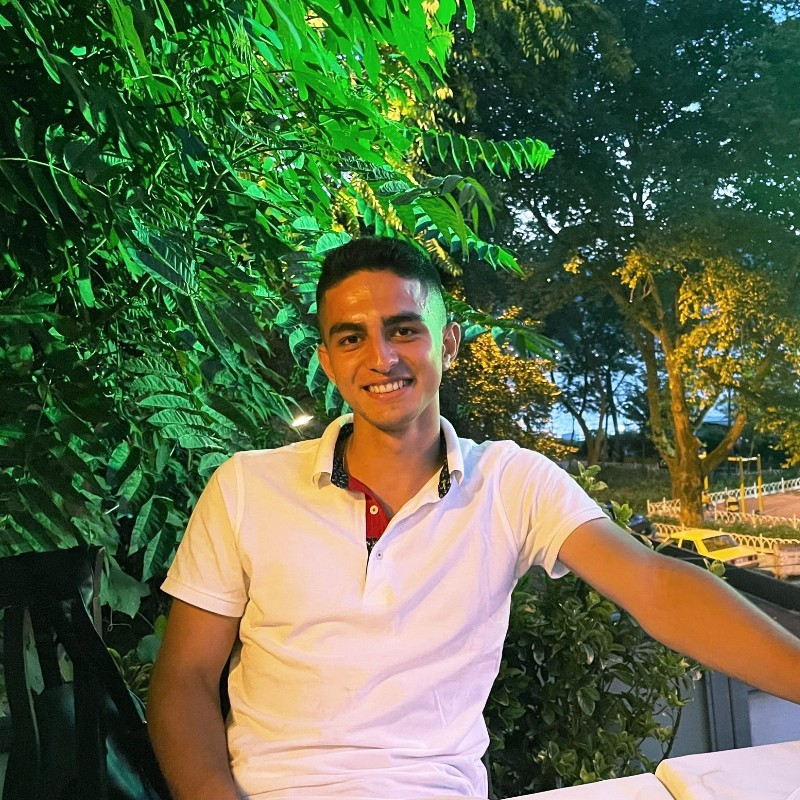

# Recep Ulaş Uzun

**M.Eng. AI for Smart Sensors & Actuators · THD Deggendorf · Erlangen, Germany**

I build things at the intersection of **computer vision, industrial AI, and embedded systems**. Currently pursuing my master's (GPA 1.0), after a B.Sc. in Computer Engineering on a full scholarship. Open to working student roles in Bayern.

---

## Featured Projects

| Project | Stack | Highlight |
|---|---|---|
| [**Low-Altitude Aerial Detection**](https://github.com/BUAksakal/low-altitude-aerial-detection) | YOLOv8 · PyTorch · CVAT | THI × Fraunhofer IVI × THD — 3–9m drone footage, custom dataset |
| [**Helmet Detection**](https://github.com/salamon30/helmet-detection) | YOLOv8s · Streamlit | 92.8% mAP@50 · real-time PPE compliance monitoring |
| [**Sensor Anomaly Detection**](https://github.com/salamon30/sensor-anomaly-detection) | Isolation Forest · scikit-learn | 95% F1 · unsupervised, no labels needed |
| [**Coil Cooling Digital Twin**](https://github.com/salamon30/cool-cooling) | Python · Streamlit · SciPy | Industry collab with Borçelik — live thermal simulation |

---

## Tech Stack

**Languages**

**AI / ML**

**Data & Analytics**

**Web**

---

## GitHub Stats

  
  

  

---

## Currently Building

- **[Active]** Low-altitude drone object detection — custom dataset annotation + YOLOv8 fine-tuning (Fraunhofer IVI)
- **[Active]** Edge AI deployment experiments — running inference on embedded hardware
- **[Active]** Open to Werkstudent roles in AI / ML / computer vision in Bayern

---

## Experience

| Company | Role | Year |
|---|---|---|
| Vodafone Türkiye | Data Science Intern | 2025 |
| KPMG Türkiye | Data Analyst & Digital Trainee | 2024–25 |
| McKinsey Forward Program | Problem-solving & Digital Strategy | 2023 |

---

## Beyond the Code

Turkish Junior Tennis Champion (2014) · 18+ years competitive experience · Currently playing at 1. FC Nürnberg · Coaching at FAU Erlangen-Nürnberg and University of Regensburg

---

Languages: Turkish 🇹🇷 · English 🇬🇧 · German 🇩🇪 (learning) · French 🇫🇷 (learning)
